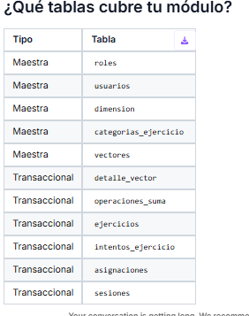

# VectoFlow 🔢

**Módulo:** Suma Interactiva de Vectores — Plataforma educativa para aprender operaciones con vectores en programación.

## ¿Qué módulo implementas?
Módulo de **Suma de Vectores** con gestión de usuarios, historial de operaciones y visualización paso a paso del proceso C[i] = A[i] + B[i].

## ¿Qué tablas cubre tu módulo?

## ¿Qué framework elegiste y por qué?
Node.js + Express.js

    - Es liviano y perfecto para APIs REST
    - Permite manejar autenticación JWT de forma nativa
    - JavaScript en frontend y backend reduce la curva de aprendizaje
    - Respaldado por el Diagrama de Componentes (E5) que define la arquitectura en capas

## ¿Cómo ejecutar el proyecto?
# 1. Clonar el repositorio
git clone https://github.com/emanuel1chaverra-source/VectoFlow.git

# 2. Entrar a la carpeta del proyecto
cd VectoFlow/Vecto-Flow/pjc

# 3. Instalar dependencias
npm install

# 4. Configurar variables de entorno
    - # Crear archivo .env con:
    -# DB_HOST=localhost
    -# DB_USER=root
    -# DB_PASSWORD=tu_password
    -# DB_NAME=vectoflow
    -# JWT_SECRET=tu_clave_secreta

# 5. Ejecutar el servidor
node server.js

## ¿Cual es el repositorio de tu compañero?
Mario Alberto Rodriguez y Emanuel Chaverra Marín manejamos un mismo repositorio, ya que los dos decidimos trabajar en equipo