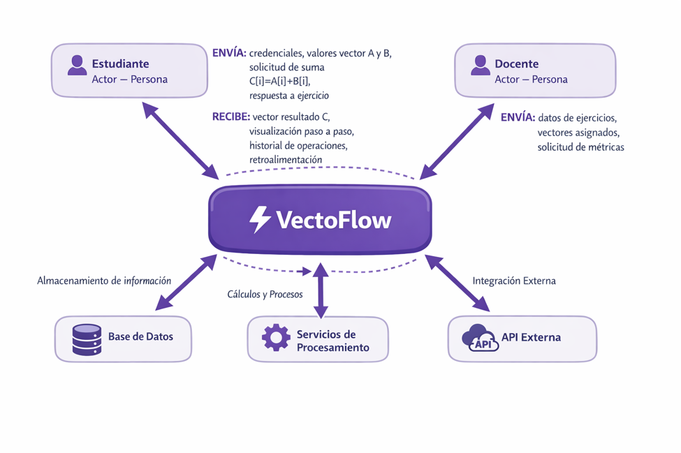

# Diagrama de Contexto y Actores (DCA)

El sistema central es la Plataforma Web VectoFlow. Interactúa con cuatro entidades externas: Estudiante, Docente, Administrador y Módulo de Autenticación.

________________________________________

