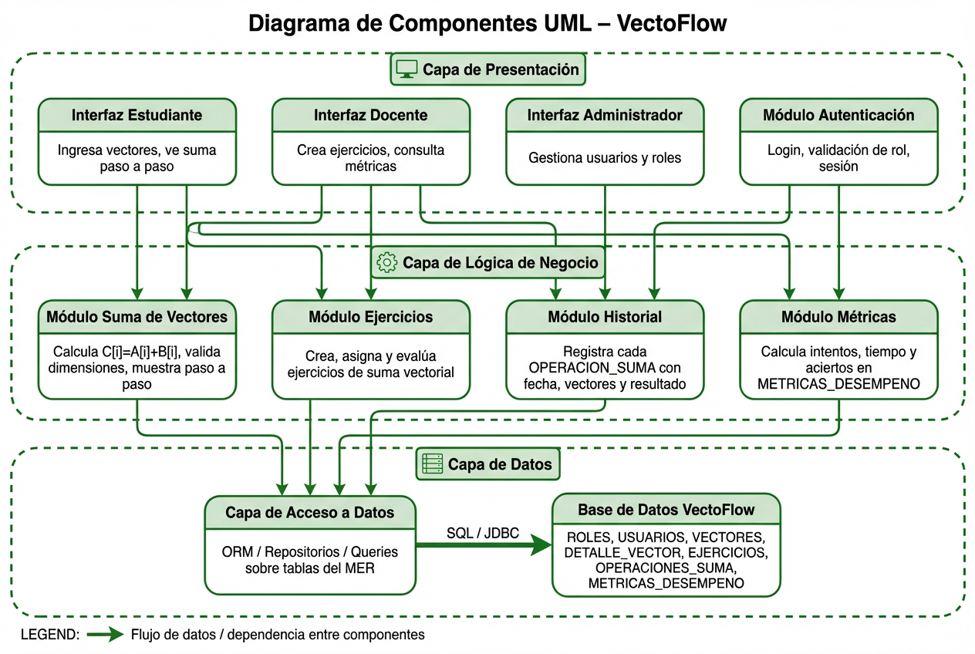

# Diagrama de Componentes (Arquitectura por Capas)

La arquitectura del sistema VectoFlow se organiza en tres capas: Capa de Presentación (interfaces de usuario), Capa de Lógica de Negocio (módulos funcionales) y Capa de Datos (acceso a base de datos).

